# Andrii Vynohradov

**Systems Architect & Lead Backend Engineer**  
Victoria, BC, Canada • [vynohradov.ca](https://vynohradov.ca) • [LinkedIn](https://linkedin.com/in/resonaura) • [Email](mailto:andrii.vynohradov@gmail.com) • [CV (PDF)](cv.pdf) • [Credentials](https://certificates.vynohradov.ca)

[-049EF4.svg?style=flat-square&logo=threedotjs&logoColor=white)](#)

I build low-latency real-time systems in C++, distributed backend architectures, and production AI agent runtimes. My background spans real-time digital signal processing, lock-free concurrency, high-throughput video streaming, and hardware automation protocols.

---

## Featured Systems & Engineering Work

### ResoStage
*Real-Time Live Performance DAW & Stage Lighting Sequencer (Private Codebase)*  
**Stack**: C++20, JUCE 9, Lock-Free Concurrency, Electron, React 19, Three.js, WebSockets, DMX-512, Art-Net, sACN

A live performance workstation designed for zero-dropout multitrack playback synchronized with automated lighting rigs.

  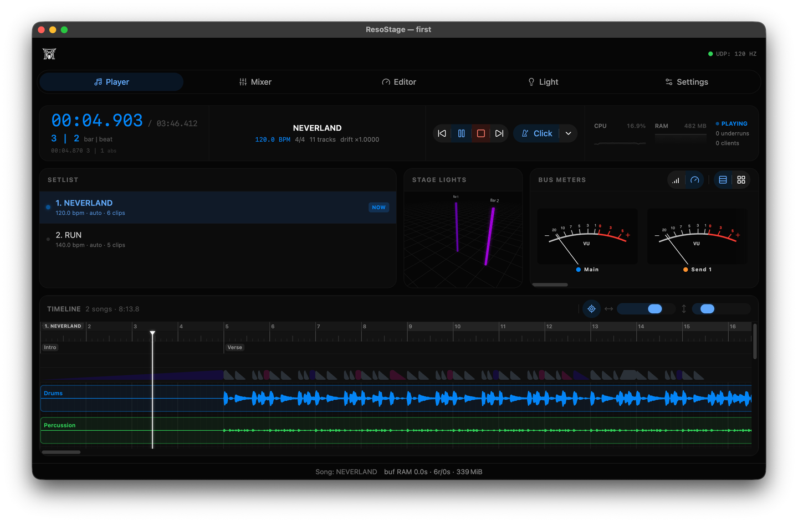

- **Audio Engine**: Operates under a strict zero-heap-allocation policy in the audio callback. Utilizes precomputed 64-point Kaiser-windowed Sinc interpolation for pitch shifting and sample-accurate clock sync across 32+ tracks.
- **Lock-Free Concurrency**: Audio threads communicate with background workers through single-producer single-consumer (SPSC) ring buffers and atomic state flags, eliminating priority inversions and audio dropouts during disk read stalls.
- **Process Supervisor (Kaishaku)**: A native daemon monitors application processes over local IPC heartbeat channels. If the Electron UI crashes during a live show, the audio engine continues running uninterrupted while the supervisor relaunches the interface within 300 milliseconds.
- **Stage Lighting Engine**: Generates 60 Hz fixture control packets across DMX-512, Art-Net, and sACN (ANSI E1.31) over UDP, alongside a custom binary protocol driving networked ESP32 microcontrollers.
- **3D Visualizer**: Real-time WebGL stage visualizer in Three.js rendering moving heads, trusses, and beam geometry at 60 FPS.

### ResoPatch
*Interactive Stage Routing Graph & Technical Rider Generator*  
**Stack**: React 19, TypeScript 5.9, @xyflow/react, libavoid-js (WASM), HeroUI v3, NestJS 11, Fastify, SQLite, Puppeteer  
**Repo**: [resonaura/resopatch](https://github.com/resonaura/resopatch)

Interactive audio patchbay coordinator translating complex stage cabling, pedalboards, audio interfaces, and electrical distribution into a validated visual node graph.

  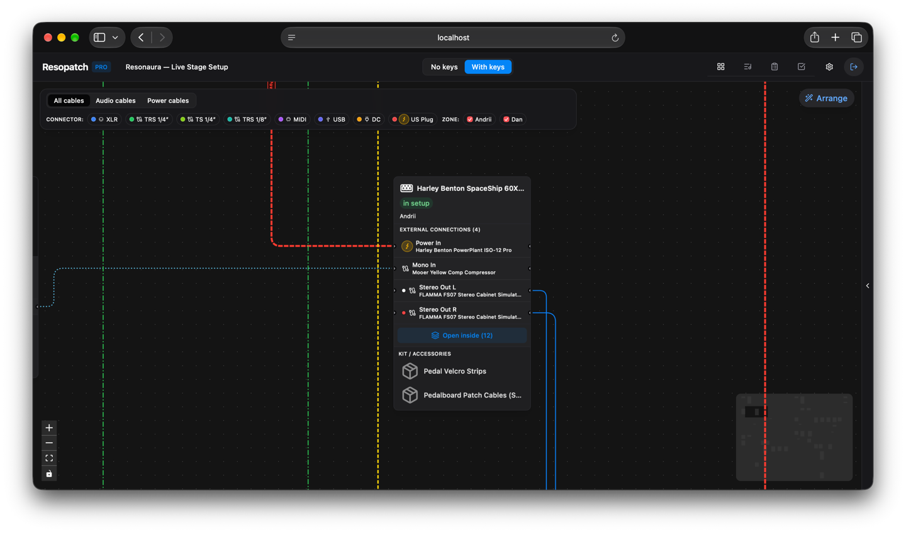

- **WASM Obstacle Avoidance Routing**: Integrates libavoid compiled to WebAssembly inside an isolated Web Worker to compute dynamic orthogonal cable trajectories that navigate around hardware equipment footprints.
- **Physical Boundary Validation**: Enforces signal compatibility across balanced line level, microphone signals, high-Z instrument inputs, and isolated DC pedalboard rails.
- **Automated Technical Rider Generation**: Evaluates stage box topology to compile FOH channel assignment charts, backline requirements, and packing checklists into printable A4 PDFs via headless Puppeteer.
- **Real-Time Collaboration**: Propagates patch updates and mute states between stage crew and FOH engineers during soundchecks over low-latency Socket.IO channels.

### Indago AI Platform & Multi-Agent Runtime
*Lead AI Platform Engineer & Systems Architect (IndagoDev)*  
**Stack**: Node.js, NestJS, Python (FastAPI), vLLM, Ollama, LangGraph, Redis, PostgreSQL, MinIO, Docker

Architected the distributed infrastructure for multi-step autonomous agent execution and local model inference.

- Decomposed a legacy monolithic backend into event-driven NestJS microservices, supporting 1,000+ parallel AI agents while cutting p95 gateway latency from 450ms to 315ms under heavy load.
- Built a production Hybrid RAG pipeline combining pgvector similarity search with structured metadata pre-filtering, reducing token overhead by ~40%.
- Deployed a distributed bare-metal MinIO S3 storage cluster on Linux servers, eliminating 70% of cloud data storage and egress expenses.
- Implemented real-time WebSocket telemetry streaming with sub-100ms client updates for active user sessions.
- Provisioned sandboxed container execution environments with automated health checks and self-healing worker pools.

### Autonomous Agent Runtime & Visual Stream
*AI Agent Operating Infrastructure & Activity Feed (Private Codebase)*  
**Stack**: Node.js, TypeScript, Docker, WebSockets, Redis, IPC RPC, React

Execution runtime and distributed coordination layer for independent autonomous AI agents.

- Built an execution engine with process isolation, daemon RPC connection pooling, and stale socket eviction.
- Developed a visual activity feed where autonomous agents publish execution checkpoints, generated artifacts, media snippets, and quote interactions in real time.
- Implemented containerized sandboxes with resource quota enforcement and dynamic work scheduling.

### RSNRA Music Ecosystem & Interactive Web
*Streaming Infrastructure, Digital Identity & Creative Homages*  
**Stack**: React 18, TypeScript, Tailwind CSS, Web Audio API, OAuth 2.0 / SSO, WebSockets

- **[rsnra.link](https://rsnra.link)** (private repository: [rsnra-link](https://github.com/resonaura/rsnra-link)): Hybrid music ecosystem combining direct high-fidelity audio streaming, interactive band storytelling, and unified smart links connecting fans to major platforms.

  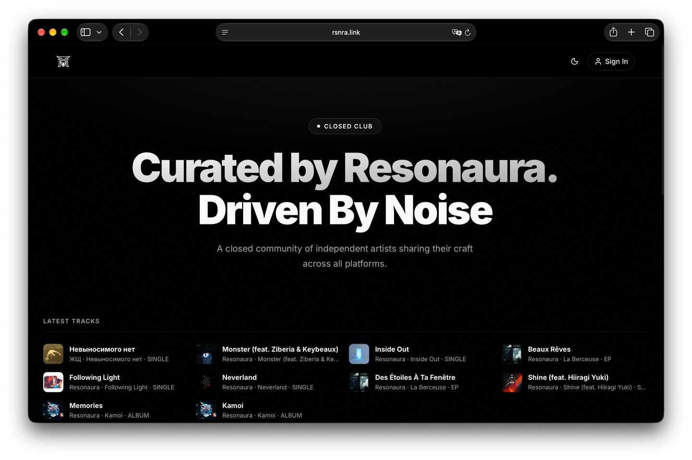

- **[rsnra.art](https://rsnra.art)** (repo: [rsnra-art](https://github.com/resonaura/rsnra-art)): Interactive digital desktop rebuilt as a fully functional, draggable, minimizable tribute to Windows 95, featuring custom window managers, retro audio design, and a playable media player.

  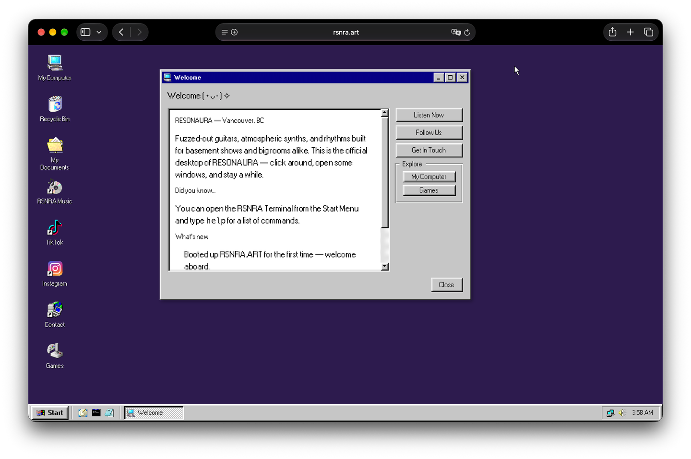

- **[rsnra-auth](https://github.com/resonaura/rsnra-auth)**: Central identity provider handling OAuth single sign-on (SSO), token validation, and profile sessions across all RSNRA web services.
- **[authorplay](https://github.com/resonaura/authorplay)**: Standalone web streaming platform for independent musicians, serving as the direct architectural predecessor to rsnra.link.

  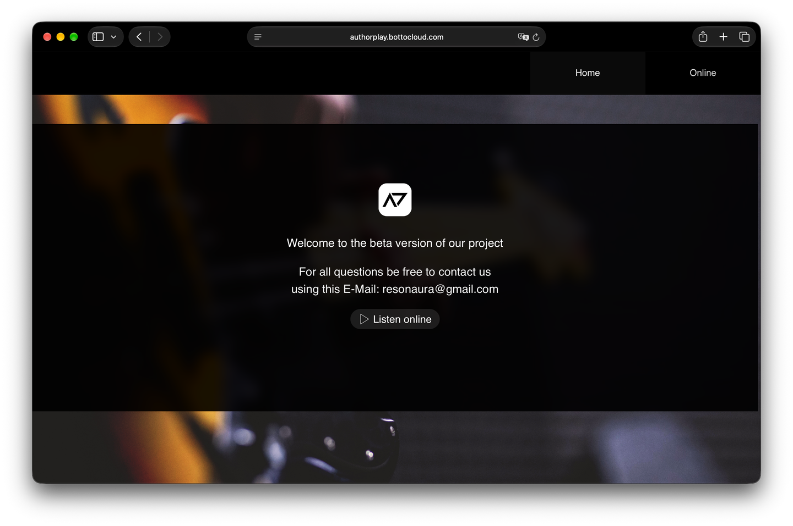

---

## Audio DSP Plugins & Hardware Instruments

- **[scratcher](https://github.com/resonaura/scratcher)**: Dual-deck vinyl scratch emulator audio plugin and standalone instrument built with JUCE 8 and C++17. Features realistic turntable physics, time-stretching, and MIDI control surface mapping.

  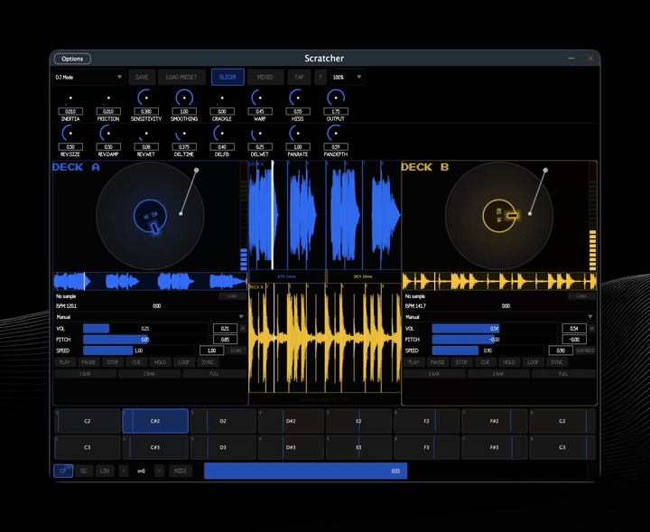

- **[flopster](https://github.com/resonaura/flopster)**: Software synthesizer (VST3, AU, Standalone) simulating retro floppy drive acoustics and mechanical stepping motors.

  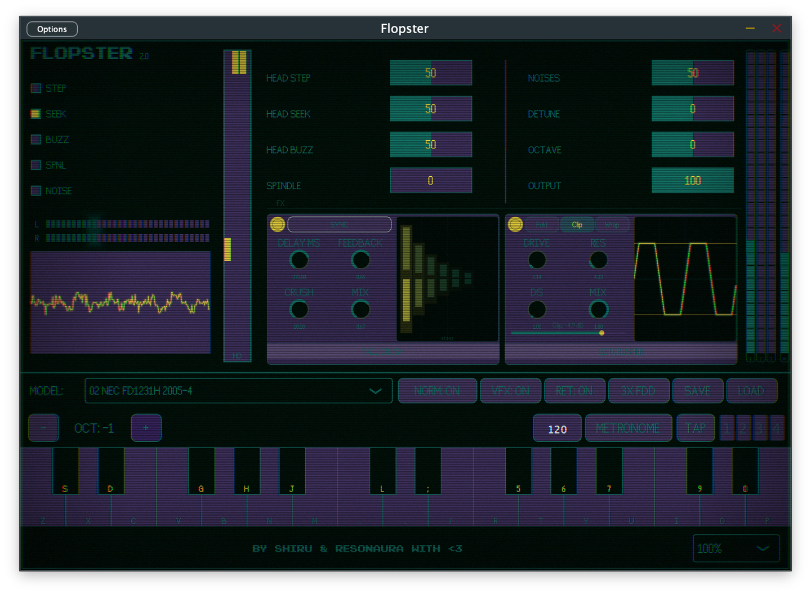

- **[shaitan-delay](https://github.com/resonaura/shaitan-delay)**: Stereo delay audio plugin (VST3) with adjustable tape saturation, feedback filtering, and tempo sync.

  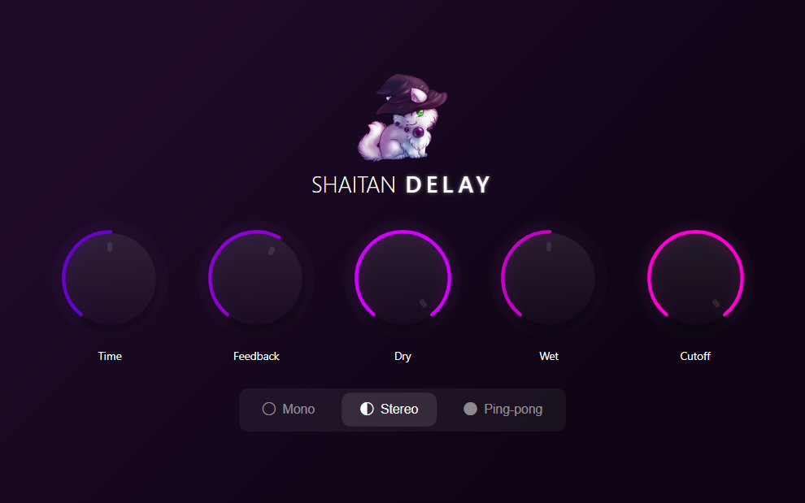

- **[owlydist](https://github.com/resonaura/owlydist)**: Audio distortion plugin (VST3) powered by the Elementary Audio DSP engine.

  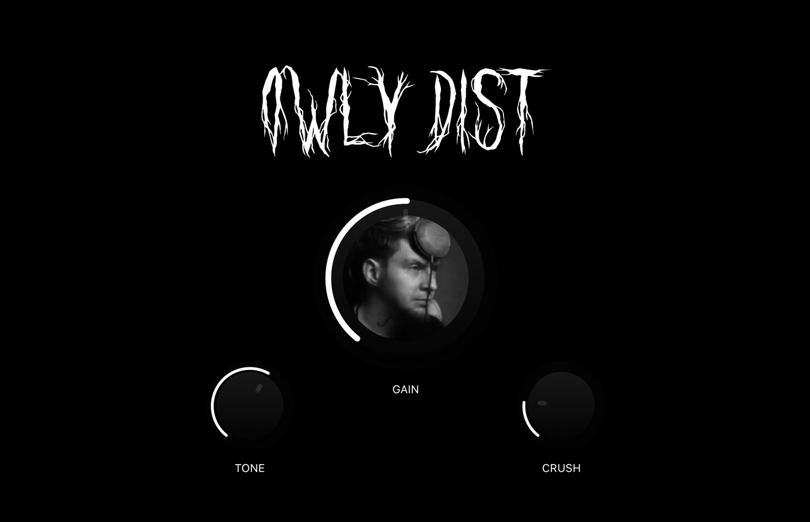

- **[resobox-core](https://github.com/resonaura/resobox-core)** & **[resobox-ui](https://github.com/resonaura/resobox-ui)**: Low-latency audio processing DSP engine and interface built for a custom hardware guitar pedalboard.

  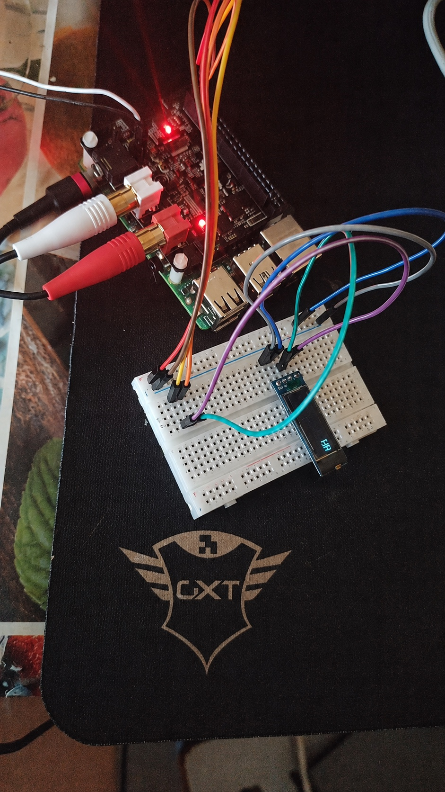

- **[foxled](https://github.com/resonaura/foxled)**: Ambient backlighting workstation with low-latency NAudio WASAPI loopback capture, real-time FFT spectrum analysis, and serial Adalight streaming.

  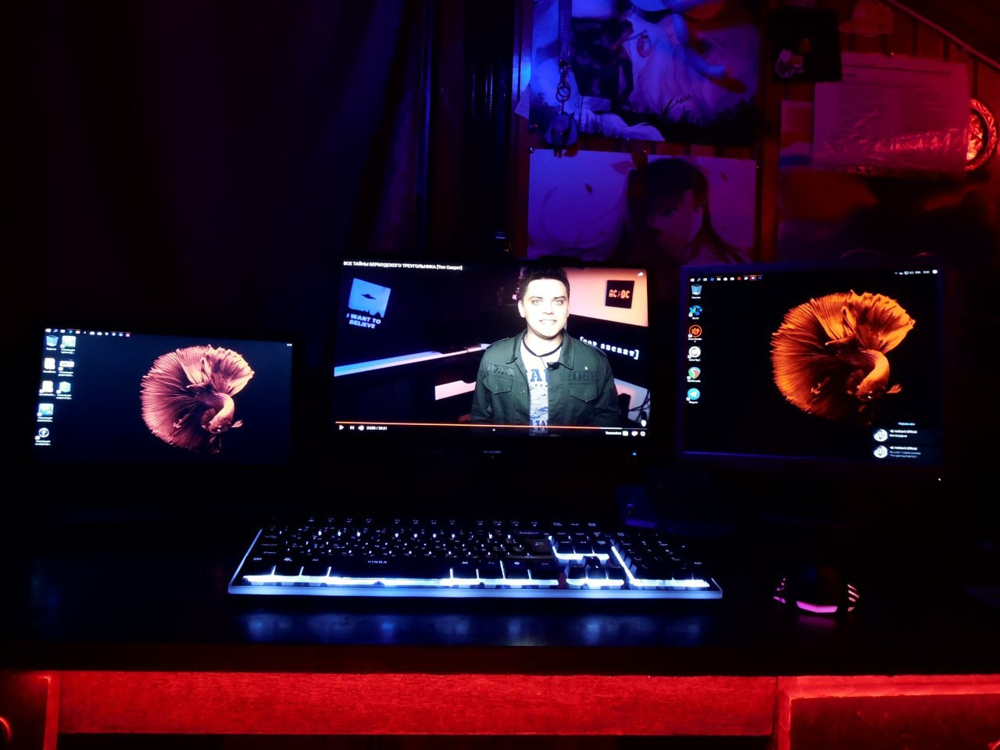

---

## Smart Home, Embedded & Edge Video Systems

- **[scrypted-tuya](https://github.com/resonaura/scrypted-tuya)**: Standalone camera bridge interfacing with Tuya and Smart Life hardware, converting proprietary WebRTC streams into low-latency RTSP feeds without cloud dependencies.

  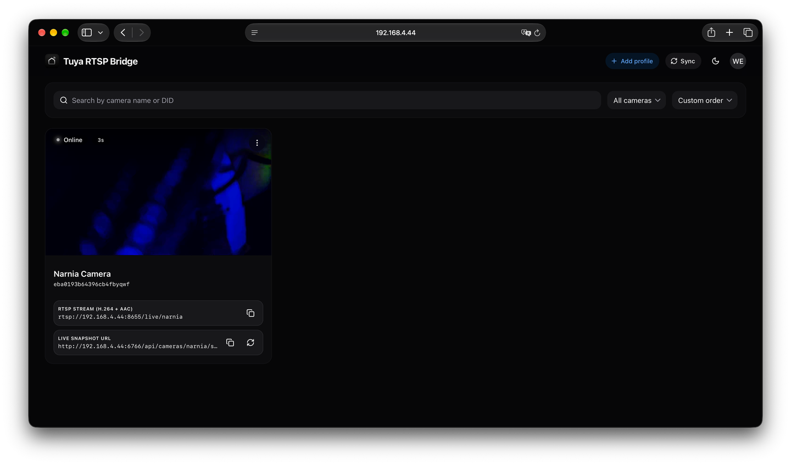

- **[snappie](https://github.com/resonaura/snappie)**: Hardware-accelerated multi-camera RTSP snapshot server with zero-disk in-memory caching, supporting CUDA, VA-API, Intel QSV, and Apple VideoToolbox.
- **[aqara-g5pro-mqtt](https://github.com/resonaura/aqara-g5pro-mqtt)**: Universal MQTT and RTSP integration bridge for Home Assistant featuring bidirectional two-way audio talkback.
- **[nixie-clock-mqtt](https://github.com/resonaura/nixie-clock-mqtt)**: MQTT integration bridge for the Clocteck RGB Tube Clock, exposing lighting controls and digits to Home Assistant via auto-discovery.
- **[foxyswitch](https://github.com/resonaura/foxyswitch)** & **[foxyhome](https://github.com/resonaura/foxyhome)**: Custom C++ / ESP32 firmware running on physical smart wall switches and connected domestic sensors.
- **[ble-smart-light](https://github.com/resonaura/ble-smart-light)**: Reverse-engineered 10-byte BLE GATT protocol controller for Supra / Eboylight smart lamps on Windows 10 UWP and Android.

  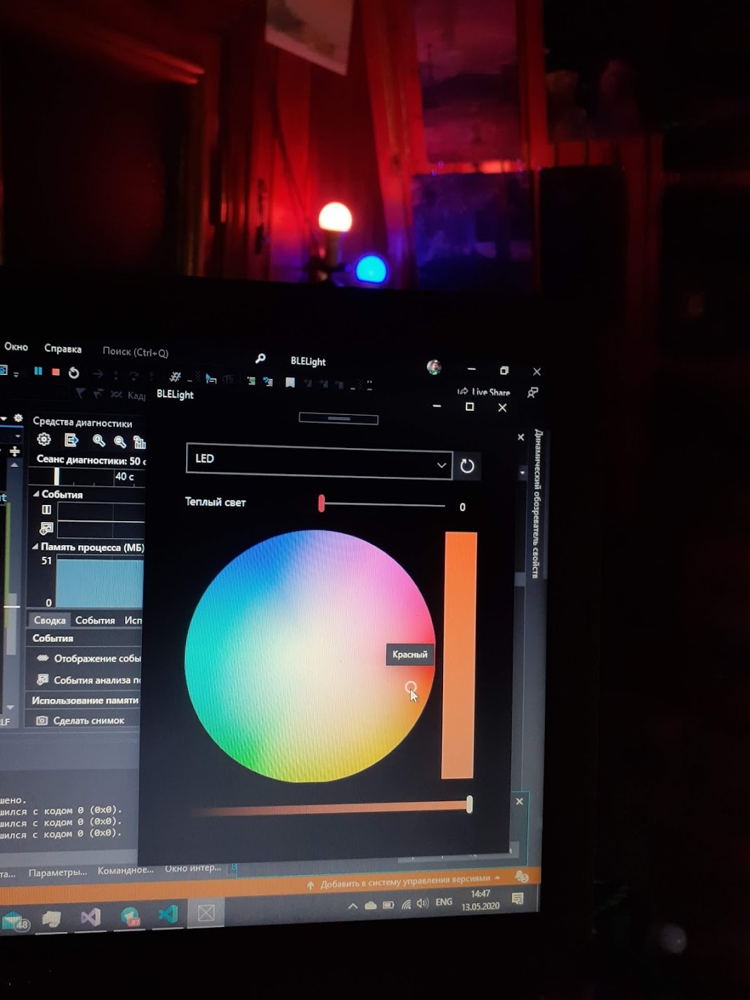

- **[homebridge-sinricpro](https://github.com/resonaura/homebridge-sinricpro)**: Open-source contribution mapping SinricPro connected devices directly into Apple HomeKit via Homebridge.

---

## Windows Systems & Desktop Utilities

- **[apps-indexator](https://github.com/resonaura/apps-indexator)**: High-speed Windows application indexer and icon extractor using direct Win32, Shell32, and GDI32 system calls.
- **[foxdock](https://github.com/resonaura/foxdock)**: Windows application dock featuring Fluent Acrylic design, shell integration, and background IPC daemon.

  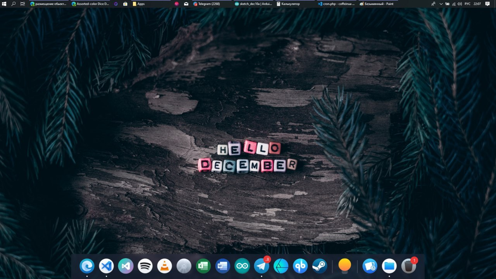

- **[ktulhu-server](https://github.com/resonaura/ktulhu-server)**: Home server manager with Acrylic WPF dashboard, OpenHardwareMonitor telemetry, ngrok tunnel coordinator, and Telegram webhooks.

  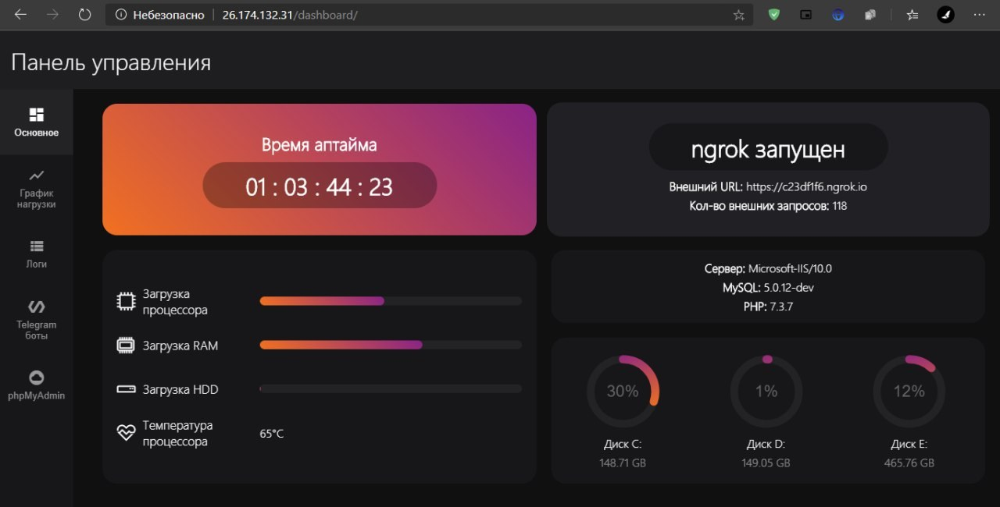

- **[isekai-sub-tool](https://github.com/resonaura/isekai-sub-tool)**: Production dialogue and subtitle timing software built for The Walking Dead fan dubbing project.

  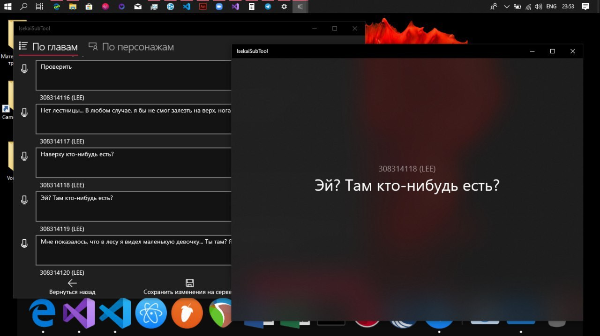

- **[filerabbit](https://github.com/resonaura/filerabbit)**: Cloud file storage and sharing web application built on ASP.NET Core and Entity Framework Core.

  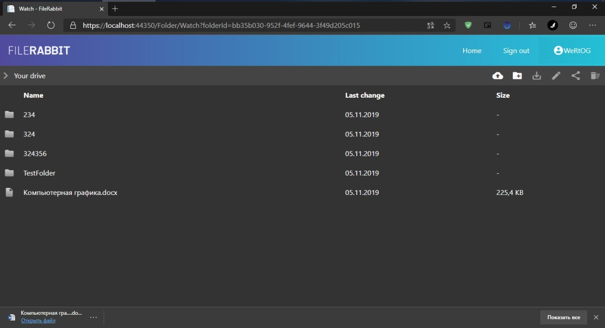

---

## Infrastructure, Automation & Community Bots

- **[gsync](https://github.com/resonaura/gsync)**: Interactive Terminal UI (TUI) for real-time bi-directional cloud synchronization with Google Drive, rsync, and rclone.

  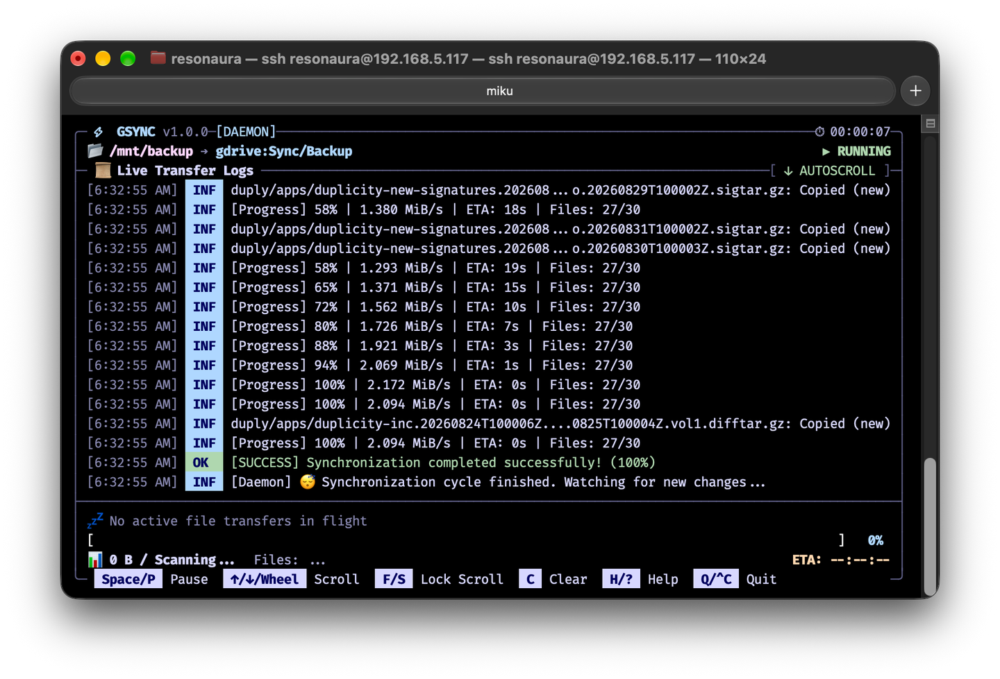

- **[miku-renderer](https://github.com/resonaura/miku-renderer)**: Declarative Node.js and FFmpeg multi-track video composition engine with render queue management.
- **[rocket-alert-monitor](https://github.com/resonaura/rocket-alert-monitor)**: Real-time emergency siren and missile alert monitoring service with push notification dispatch.
- **[resomd](https://github.com/resonaura/resomd)**: Live split-pane markdown editor with block-level scroll synchronization, cloud autosave, and headless PDF export.

  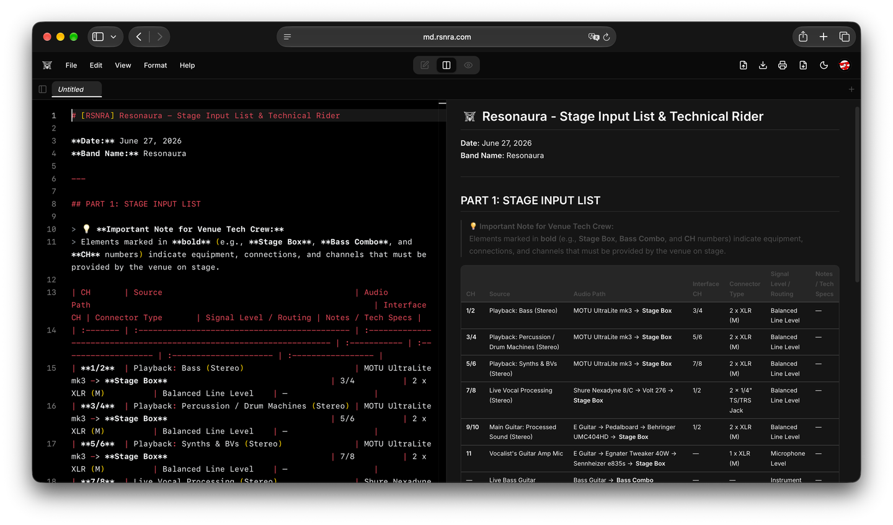

- **[bottogram](https://github.com/resonaura/bottogram)**: PHP 8 Telegram bot framework with an integrated administrative interface and conversion funnels.
- **[foxy-mvc](https://github.com/resonaura/foxy-mvc)**: Lightweight PHP 8 MVC framework optimized for shared hosting environments.
- **[webpack-unicode-plugin](https://github.com/resonaura/webpack-unicode-plugin)**: Webpack compiler plugin preventing Unicode character corruption in bundled production assets.
- **vagachat-bot & vagakeeper** *(Private)*: Community protection, anti-spam, and member verification bots built for musician and blogger Vaganych's Telegram community.

---

## Interactive & Web Applications

- **[KidCanvas](https://kidcanvas.skrinkaznan.com/)**: Collaborative real-time digital canvas platform for children and educators. Features instantaneous multi-user stroke synchronization over WebSockets, HTML5 Canvas rendering, and clean drawing tools.

  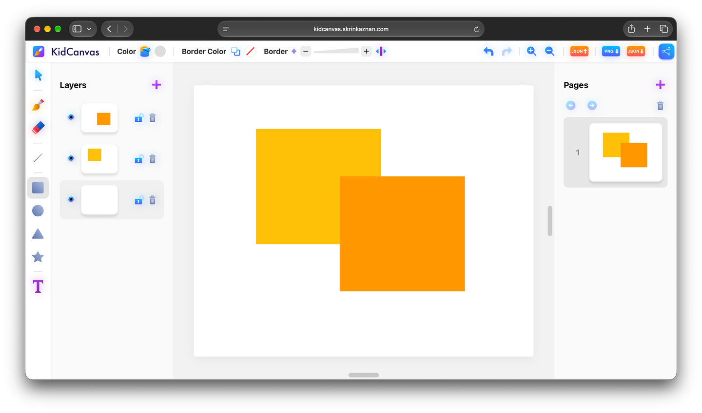

- **[Personal Portfolio](https://github.com/resonaura/portfolio)** ([vynohradov.ca](https://vynohradov.ca)): Interactive personal portfolio website featuring custom Three.js GLSL fluid simulation shaders, iPadOS magnetic cursor physics, and responsive slide layouts.
- **[maria-portfolio](https://github.com/resonaura/maria-portfolio)**: Designer portfolio SPA with a custom NestJS / Fastify / Sharp image transformation engine and dynamic luminance mapping.

  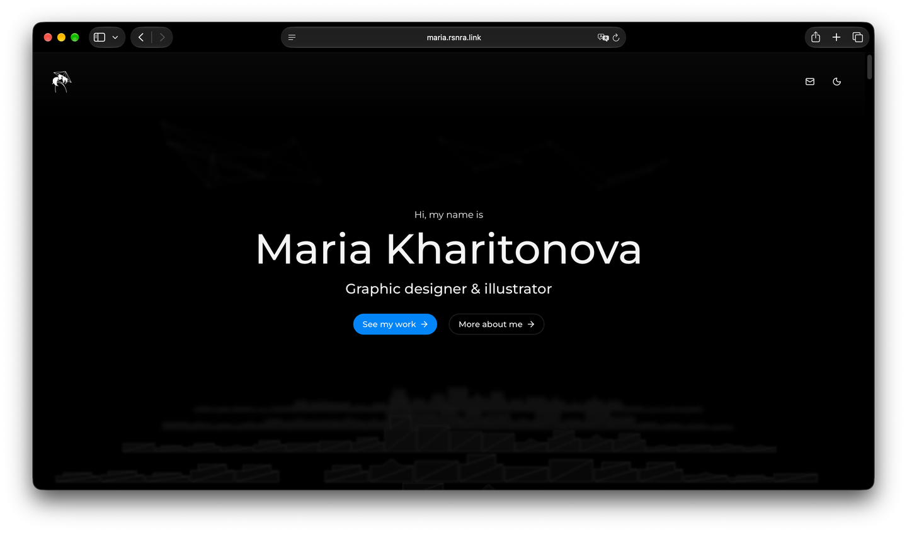

- **Alchemy** ([portfolio](https://github.com/resonaura/portfolio)): Multi-model LLM workspace and Chrome extension interface coordinating prompt pipelines across OpenAI and Claude APIs.

  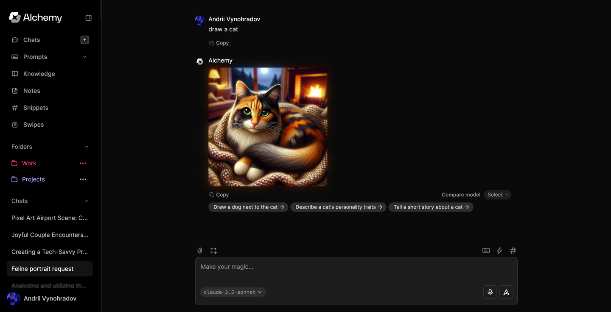

- **UniVent** ([portfolio](https://github.com/resonaura/portfolio)): Cross-platform mobile event discovery application built with React Native, TypeScript, and native bridge modules for iOS and Android.

  

- **[noir-chrome-theme](https://github.com/resonaura/noir-chrome-theme)**: Minimalist deep black theme for Google Chrome.

---

## Technical Competencies

- **Systems & Low-Latency**: C++20, JUCE 9, Lock-Free Concurrency, Zero-Allocation Real-Time Audio, DSP, Sinc Resampling, DMX-512, Art-Net, sACN (E1.31), MIDI, ESP32 UDP.
- **AI & Agent Systems**: Agent Orchestration, Hybrid RAG, Vector Search (pgvector), Local Inference (vLLM, Ollama), Model Quantization (GGUF, AWQ), LangGraph, Vercel AI SDK.
- **Backend & Cloud**: Node.js, NestJS, Python (FastAPI, Django), C# (.NET Core / ASP.NET), PostgreSQL, Redis, BullMQ, MinIO, Docker, Traefik, WireGuard.
- **Frontend & Platforms**: TypeScript, React, Next.js, React Native, Electron, Three.js (WebGL), Tailwind CSS, Vite.

---

## Education & Credentials

- **Fachinformatiker für Anwendungsentwicklung** (IHK-Certified Dual Vocational Program, Germany) (completed ahead of schedule with honors); evaluated by WES as equivalent to a Canadian Applied Computer Science Diploma.
- **Undergraduate Studies in Computer Science & Engineering** (Prydniprovska State Academy of Civil Engineering and Architecture, Ukraine) — 2 years of full-time coursework in Data Structures, Algorithms, and Software Engineering.
- **Certifications & Credentials**: [View verified certificates](https://certificates.vynohradov.ca) • [Download CV (PDF)](cv.pdf)
