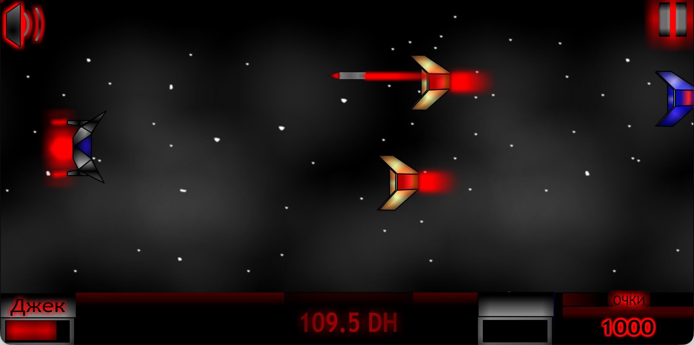

# Andrii Vynohradov

**Systems Architect & Lead Backend Engineer**  
Victoria, BC, Canada • [vynohradov.ca](https://vynohradov.ca) • [LinkedIn](https://linkedin.com/in/resonaura) • [Email](mailto:andrii.vynohradov@gmail.com) • [CV (PDF)](cv.pdf) • [Credentials](https://certificates.vynohradov.ca)

| Systems, DSP & Low-Latency | Distributed Platforms & AI | Edge Media & Hardware Protocols | High-Perf Web & WASM |
| :--- | :--- | :--- | :--- |
| **C++20**, **JUCE 9**, SIMD | **Node.js**, **NestJS**, **FastAPI** | **RTSP**, **WebRTC**, **H.264/HEVC** | **WebAssembly** (C++ to WASM) |
| SPSC Lock-Free Ring Buffers | **vLLM**, **Ollama**, **LangGraph** | **DMX-512**, **Art-Net**, **sACN** | **Three.js**, WebGL Shaders |
| Zero-Heap Audio Callbacks | **PostgreSQL**, **pgvector**, **Redis** | **BLE GATT**, **MQTT**, **WASAPI** | **React 19**, **TypeScript 5.x** |

I architect deterministic real-time C++ systems, distributed AI agent execution runtimes, and hardware-accelerated media streaming pipelines. My background spans real-time digital signal processing, lock-free concurrency, protocol reverse engineering, and low-latency edge computing.

---

## Tier 1: Real-Time Systems, Audio DSP & Hardware Protocols

### ResoStage
*Real-Time Live Performance DAW & Stage Lighting Sequencer (Private Codebase)*  
**Stack**: C++20, JUCE 9, Lock-Free Concurrency, Electron, React 19, Three.js, WebSockets, DMX-512, Art-Net, sACN

Real-time live performance workstation designed for deterministic zero-dropout multitrack playback synchronized with automated stage lighting rigs.

  

- **Deterministic Audio Engine**: Operates under a strict zero-heap-allocation policy within the real-time audio callback loop. Utilizes precomputed 64-point Kaiser-windowed Sinc interpolation for pitch shifting and sample-accurate clock synchronization across 32+ simultaneous stems.
- **Lock-Free Concurrency**: Audio threads communicate with background disk workers and UI decoders through single-producer single-consumer (SPSC) ring buffers and atomic memory fences, eliminating mutex contention, priority inversions, and buffer underruns during disk read stalls.
- **Process Supervisor (Kaishaku)**: A native daemon monitors application processes over local IPC heartbeat channels. If the Electron UI crashes during a live performance, the audio engine continues running uninterrupted while the supervisor relaunches the interface within 300 milliseconds.
- **Stage Lighting Engine**: Generates 60 Hz fixture control packets across DMX-512, Art-Net, and sACN (ANSI E1.31) over UDP, alongside a custom binary protocol driving networked ESP32 microcontrollers.
- **3D Spatial Visualizer**: Real-time WebGL stage visualizer in Three.js rendering moving heads, concert trusses, and volumetric light beam geometry at 60 FPS.

### Native Audio DSP Plugins & Embedded Silicon
- **[scratcher](https://github.com/resonaura/scratcher)**: Dual-deck vinyl scratch emulator audio plugin and standalone instrument built with JUCE 8 and C++17. Implements rotational physics simulations, fractional delay time-stretching, and bidirectional MIDI control surface mapping.

  

- **[flopster](https://github.com/resonaura/flopster)**: Software synthesizer (VST3, AU, Standalone) simulating retro floppy drive acoustics and mechanical stepping motor resonance via physical modeling synthesis and custom vector UI controls.

  

- **[resobox-core](https://github.com/resonaura/resobox-core)** & **[resobox-ui](https://github.com/resonaura/resobox-ui)**: Embedded Real-Time Audio Appliance. Custom hardware guitar pedalboard powered by an embedded DSP unit executing fixed-point filtering with hardware interrupts, direct memory bus ADC/DAC communication, and zero-allocation processing loops.

  

- **[shaitan-delay](https://github.com/resonaura/shaitan-delay)**: Stereo delay audio plugin (VST3) featuring analog tape saturation modeling, non-linear feedback damping filters, and host tempo synchronization.

  

- **[owlydist](https://github.com/resonaura/owlydist)**: Audio distortion plugin (VST3) powered by the Elementary Audio DSP engine, implementing customizable transfer-curve waveshaping and asymmetric clipping algorithms.

  

---

## Tier 2: Distributed Platforms, AI Agent Runtimes & Media Streaming

### Enterprise AI Systems & Autonomous Agent Infrastructure
*Systems Architect & Lead Backend (IndagoDev, 2024–2026)*  
**Stack**: Node.js, NestJS, TypeScript, Python (FastAPI), TypeORM, Docker, Redis Streams, PostgreSQL, MinIO, WireGuard, WebSockets, FFmpeg

Architected and scaled the core distributed infrastructure powering IndagoDev's multi-project AI ecosystem across autonomous agent orchestration, sandboxed execution, and declarative media rendering:

- **Alchemy (Public Showcase)**: Multi-model prompt studio and browser extension streaming low-latency responses across OpenAI, Anthropic, and local Ollama runtimes.
- **Autonomous Agent Operating System & Computer Use (Commercial)**: Distributed execution runtime and VM management layer powering autonomous multi-step agent workflows, text/media synthesis, automated social distribution, and Computer Use desktop/OS interaction.
- **High-Density Agent Cloud Hosting & Mesh Infrastructure (Commercial)**: Scaled hosting platform for autonomous Nous Research Hermes and OpenClaw agents featuring dynamic cloud VPS provisioning across Hetzner & Vultr, WireGuard mesh VPN tunnels, WebSocket daemon IPC (`/v3/agents/:serverId`), and self-healing reconciliation loops (`AgentHealthService` pinging every 60s and healing on failure).
- **Autonomous Agent Social Network (Commercial)**: Real-time event-driven social interaction layer enabling autonomous AI agents to broadcast checkpoints, discuss artifacts, and interact programmatically over WebSocket streams.
- **AI Media Generation Platform & Declarative Video Engine (Commercial)**: AI image/video generation studio with an integrated timeline editor powered by custom declarative FFmpeg rendering engine pipelines (`miku-renderer`).
- **Distributed MinIO S3 & Event Loops**: Replaced expensive cloud storage with self-hosted bare-metal MinIO S3 clusters, cutting 70% of storage expenses while maintaining sub-100ms real-time event distribution via Redis Streams.

### Edge Video Ingestion & Hardware Transcoding
- **[scrypted-tuya](https://github.com/resonaura/scrypted-tuya)**: Low-Latency Edge Video Ingestion Pipeline. Standalone camera bridge interfacing directly with Tuya hardware, demuxing proprietary WebRTC feeds into standard sub-second RTSP relays with zero-copy packet forwarding and no cloud dependencies.

  

- **[snappie](https://github.com/resonaura/snappie)**: Hardware-accelerated multi-camera RTSP snapshot server featuring zero-disk in-memory ring buffers, supporting NVENC/CUDA, Intel VA-API/QSV, and Apple VideoToolbox.
- **[aqara-g5pro-mqtt](https://github.com/resonaura/aqara-g5pro-mqtt)**: Universal MQTT and RTSP integration bridge for Home Assistant featuring low-latency bidirectional two-way audio talkback.

---

## Tier 3: WebAssembly, High-Performance Web & Platform Architecture

### ResoPatch
*In-Browser Computational Geometry Engine & Technical Rider Generator*  
**Stack**: React 19, TypeScript 5.9, @xyflow/react, libavoid-js (WASM), HeroUI v3, NestJS 11, Fastify, SQLite, Puppeteer  
**Repo**: [resonaura/resopatch](https://github.com/resonaura/resopatch)

Interactive audio patchbay coordinator translating complex stage cabling, pedalboards, audio interfaces, and electrical distribution into a validated visual node graph.

  

- **WASM Obstacle Avoidance Routing**: Compiles the native C++ `libavoid` library to WebAssembly inside an isolated Web Worker, executing dynamic A* pathfinding and orthogonal obstacle avoidance to route complex cable trajectories without overlapping hardware footprints.
- **Physical Boundary Validation**: Enforces electrical and impedance compatibility rules across balanced line level, microphone signals, high-Z instrument inputs, and isolated DC pedalboard rails.
- **Automated Technical Rider Generation**: Evaluates stage box topology to compile FOH channel assignment charts, backline requirements, and packing checklists into printable A4 PDFs via headless Puppeteer.
- **Real-Time Collaboration**: Propagates patch updates and mute states between stage crew and FOH engineers during soundchecks over low-latency Socket.IO channels.

### RSNRA Music Ecosystem & Interactive Web
*Streaming Infrastructure, Digital Identity & Creative Homages*  
**Stack**: React 18, TypeScript, Tailwind CSS, Web Audio API, OAuth 2.0 / SSO, WebSockets

- **[rsnra.link](https://rsnra.link)** (private repository: [rsnra-link](https://github.com/resonaura/rsnra-link)): Hybrid music ecosystem combining direct high-fidelity audio streaming, interactive band storytelling, and unified smart links connecting fans to major platforms.

  

- **[rsnra.art](https://rsnra.art)** (repo: [rsnra-art](https://github.com/resonaura/rsnra-art)): Interactive digital desktop rebuilt as a fully functional, draggable, minimizable tribute to Windows 95, featuring custom window managers, retro audio design, and a playable media player.

  

- **[rsnra-auth](https://github.com/resonaura/rsnra-auth)**: Central identity provider handling OAuth single sign-on (SSO), token validation, and profile sessions across all RSNRA web services.
- **[authorplay](https://github.com/resonaura/authorplay)**: Standalone web streaming platform for independent musicians, serving as the direct architectural predecessor to rsnra.link.

  

### Interactive Web & Mobile
- **[KidCanvas](https://kidcanvas.skrinkaznan.com/)**: Collaborative real-time digital canvas platform developed at IndagoDev for children and educators. Features instantaneous multi-user stroke synchronization over WebSockets, HTML5 Canvas rendering, and clean drawing tools.

  

- **[Personal Portfolio](https://github.com/resonaura/portfolio)** ([vynohradov.ca](https://vynohradov.ca)): Interactive personal portfolio website featuring custom Three.js GLSL fluid simulation shaders and responsive layout transitions.
- **Alchemy** ([portfolio](https://github.com/resonaura/portfolio)): Multi-model LLM workspace and Chrome extension interface coordinating prompt pipelines across OpenAI and Claude APIs (IndagoDev).

  

- **UniVent** ([portfolio](https://github.com/resonaura/portfolio)): Cross-platform mobile event discovery application developed at IndagoDev, built with React Native, TypeScript, and native bridge modules for iOS and Android.

  

- **[maria-portfolio](https://github.com/resonaura/maria-portfolio)**: Designer portfolio SPA with a custom NestJS / Fastify / Sharp image transformation engine and dynamic luminance mapping.

  

---

## Tier 4: Systems Tooling, Embedded IoT & Automation

- **[foxled](https://github.com/resonaura/foxled)**: Real-Time FFT Spectrum Analyzer & Serial Protocol Driver. Captures raw system audio via WASAPI loopback, performs real-time windowed FFT frequency binning, and serializes frame-synchronized multi-zone RGB payloads over UART to addressable LED strips.

  

- **[ble-smart-light](https://github.com/resonaura/ble-smart-light)**: Bluetooth Low Energy Protocol Reverse Engineering. Sniffed, decompiled, and mapped proprietary 10-byte GATT write characteristics to produce a headless, deterministic device control daemon with zero cloud dependencies on Windows 10 UWP and Android.

  

- **[foxyswitch](https://github.com/resonaura/foxyswitch)** & **[foxyhome](https://github.com/resonaura/foxyhome)**: Custom C++ / ESP32 firmware running on physical smart wall switches with hardware debouncing interrupts and domestic sensor meshes.
- **[nixie-clock-mqtt](https://github.com/resonaura/nixie-clock-mqtt)**: MQTT integration bridge for the Clocteck RGB Tube Clock, exposing lighting controls and digits to Home Assistant via auto-discovery.
- **[homebridge-sinricpro](https://github.com/resonaura/homebridge-sinricpro)**: Open-source contribution mapping SinricPro connected devices directly into Apple HomeKit via Homebridge.
- **[gsync](https://github.com/resonaura/gsync)**: Interactive Terminal UI (TUI) for real-time bi-directional cloud synchronization with Google Drive, rsync, and rclone.

  

- **[miku-renderer](https://github.com/resonaura/miku-renderer)**: Declarative Node.js and FFmpeg multi-track video composition engine with render queue management.
- **[foxdock](https://github.com/resonaura/foxdock)**: Windows application dock featuring Fluent Acrylic design, shell integration, and background IPC daemon.

  

- **[ktulhu-server](https://github.com/resonaura/ktulhu-server)**: Home server manager with Acrylic WPF dashboard, OpenHardwareMonitor telemetry, ngrok tunnel coordinator, and Telegram webhooks.

  

- **[isekai-sub-tool](https://github.com/resonaura/isekai-sub-tool)**: Production dialogue and subtitle timing software built for The Walking Dead fan dubbing project.

  

- **[apps-indexator](https://github.com/resonaura/apps-indexator)**: High-speed Windows application indexer and icon extractor using direct Win32, Shell32, and GDI32 system calls.
- **[filerabbit](https://github.com/resonaura/filerabbit)**: Cloud file storage and sharing web application built on ASP.NET Core and Entity Framework Core.

  

- **[resomd](https://github.com/resonaura/resomd)**: Live split-pane markdown editor with block-level scroll synchronization, cloud autosave, and headless PDF export.

  

- **[rocket-alert-monitor](https://github.com/resonaura/rocket-alert-monitor)**: Real-time emergency siren and missile alert monitoring service with push notification dispatch.
- **[bottogram](https://github.com/resonaura/bottogram)**: PHP 8 Telegram bot framework with an integrated administrative interface and conversion funnels.
- **[foxy-mvc](https://github.com/resonaura/foxy-mvc)**: Lightweight PHP 8 MVC framework optimized for shared hosting environments.
- **[webpack-unicode-plugin](https://github.com/resonaura/webpack-unicode-plugin)**: Webpack compiler plugin preventing Unicode character corruption in bundled production assets.
- **vagachat-bot & vagakeeper** *(Private)*: Community protection, anti-spam, and member verification bots built for musician and blogger Vaganych's Telegram community.
- **[noir-chrome-theme](https://github.com/resonaura/noir-chrome-theme)**: Minimalist deep black theme for Google Chrome.

---

## Tier 5: Engineering Roots & Origins (GREENJIM STUDIOS, 2012–2014)

Before building real-time audio engines and distributed AI backends, I started programming at age 12. At 14, together with friends, we founded indie team GREENJIM STUDIOS and built browser games in ActionScript and Adobe Flash.

### Robohero vs Zombies
*Retro 2D Flash Platformer & Shooter (Built at age 14)*  
**Stack**: ActionScript, Adobe Flash, Vector Art, Ruffle (WASM)  
**Repo**: [resonaura/robohero-vs-zombies](https://github.com/resonaura/robohero-vs-zombies) • [Play in Browser](https://resonaura.github.io/robohero-vs-zombies/)

Multi-level 2D action platformer featuring custom physics, ammo management, coin drops, and locked progression tiers. When the unversioned project files corrupted during development, the original FLA source was lost. Rather than quitting, we started over from scratch with a revamped neon interface. That harsh lesson sparked an enduring obsession with version control, redundant backups, and defensive system architecture. Both milestones survive as compiled SWF binaries, playable in modern browsers via WebAssembly.

  

### Blood Battle
*Side-Scrolling Space Shooter (Built 2012–2014)*  
**Stack**: ActionScript, Adobe Flash, Vector Art, Ruffle (WASM)  
**Repo**: [resonaura/blood-battle](https://github.com/resonaura/blood-battle) • [Play in Browser](https://resonaura.github.io/blood-battle/)

2D horizontal space combat simulator featuring multi-angle squadron intercepts, projectile ballistics, shield depletion mechanics, and an integrated cockpit HUD with telemetry readouts and callsigns. Recovered from a legacy standalone projector binary and restored for in-browser emulation.

  

---

## Technical Competencies

- **Systems & Low-Latency**: C++20, JUCE 9, Lock-Free Concurrency, Zero-Allocation Real-Time Audio, DSP, Sinc Resampling, DMX-512, Art-Net, sACN (E1.31), MIDI, ESP32 UDP.
- **AI & Agent Systems**: Agent Orchestration, Hybrid RAG, Vector Search (pgvector), Local Inference (vLLM, Ollama), Model Quantization (GGUF, AWQ), LangGraph, Vercel AI SDK.
- **Backend & Cloud**: Node.js, NestJS, Python (FastAPI, Django), C# (.NET Core / ASP.NET), PostgreSQL, Redis, BullMQ, MinIO, Docker, Traefik, WireGuard.
- **Frontend & Platforms**: TypeScript, React, Next.js, React Native, Electron, Three.js (WebGL), Tailwind CSS, Vite.

---

## Education & Credentials

- **Fachinformatiker für Anwendungsentwicklung** (IHK-Certified Dual Vocational Program, Germany) (completed ahead of schedule with honors); evaluated by WES as equivalent to a Canadian Applied Computer Science Diploma.
- **Undergraduate Studies in Computer Science & Engineering** (Prydniprovska State Academy of Civil Engineering and Architecture, Ukraine) — 2 years of full-time coursework in Data Structures, Algorithms, and Software Engineering.
- **Certifications & Credentials**: [View verified certificates](https://certificates.vynohradov.ca) • [Download CV (PDF)](cv.pdf)
